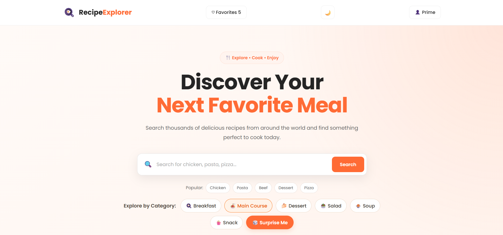
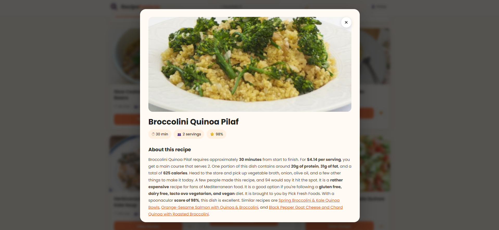
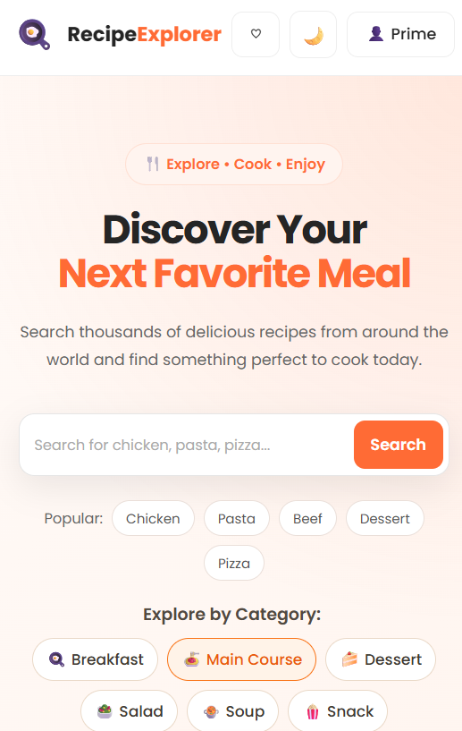

# 🍳 RecipeExplorer

A modern and responsive recipe discovery web application that helps users search, explore, and save recipes based on their preferences.

## 🌐 Live Demo

[RecipeExplorer](https://recipe-explorer-sage.vercel.app)

## 📌 About the Project

RecipeExplorer is a full-featured recipe discovery application built with HTML, CSS, and JavaScript.

The application uses the Spoonacular API to retrieve recipe data and Supabase to provide user authentication and persistent favorite recipes.

The project was designed with a focus on a clean user interface, responsive design, accessibility, and a smooth user experience.

## ✨ Features

- 🔎 Search recipes by name
- 🍽️ Browse recipes by category
- 🌎 Explore recipes by cuisine
- 🥕 Search recipes using ingredients
- 🎲 Surprise Me recipe discovery
- 📖 View detailed recipe information
- ❤️ Add and remove favorite recipes
- 👤 User registration and login
- 🔐 Secure authentication with Supabase
- 💾 Persistent favorites stored in Supabase
- 🌙 Dark and light theme
- 🔔 Toast notifications
- 💀 Skeleton loading states
- 📱 Responsive design for desktop and mobile
- ♿ Accessibility-focused UI
- ✨ Smooth UI animations
- 🏳️ Local cuisine flag assets
- 🔄 Favorites remain available after page refresh

## 📸 Screenshots

### Home Page



### Recipe Details



### Mobile View



## 🛠️ Tech Stack

### Frontend

- HTML5
- CSS3
- JavaScript (ES6+)
- Vite

### APIs & Backend Services

- Spoonacular API — recipe data
- Supabase — authentication and database

### Deployment

- GitHub — source code and version control
- Vercel — production deployment

## 🏗️ Project Structure

```text
RecipeExplorer/
│
├── assets/
│   ├── favicon.svg
│   ├── flags/
│   │   ├── china.svg
│   │   ├── india.svg
│   │   ├── italy.svg
│   │   ├── japan.svg
│   │   └── mexico.svg
│   │
│   └── screenshots/
│       ├── home.png
│       ├── recipe-details.png
│       └── mobile.png
│
├── src/
│   ├── api.js
│   ├── app.js
│   └── supabase.js
│
├── .gitignore
├── index.html
├── index.js
├── package.json
├── package-lock.json
├── README.md
└── style.css